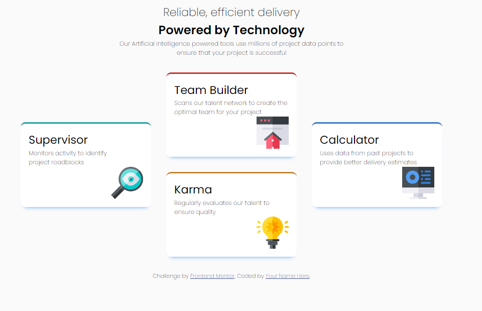

# Frontend Mentor - Four card feature section solution

This is a solution to the [Four card feature section challenge on Frontend Mentor](https://www.frontendmentor.io/challenges/four-card-feature-section-weK1eFYK). Frontend Mentor challenges help you improve your coding skills by building realistic projects. 

## Table of contents

- [Overview](#overview)
  - [The challenge](#the-challenge)
  - [Screenshot](#screenshot)
  - [Links](#links)
- [My process](#my-process)
  - [Built with](#built-with)
  - [What I learned](#what-i-learned)
  - [Continued development](#continued-development)
  - [Useful resources](#useful-resources)
- [Author](#author)
- [Acknowledgments](#acknowledgments)

## Overview

### The challenge

Users should be able to:

- View the optimal layout for the site depending on their device's screen size

### Screenshot



### Links

- Solution URL: [https://github.com/lank81/FourCard_Feature]
- Live Site URL: [https://lank81.github.io/FourCard_Feature/]

## My process

### Built with

- Semantic HTML5 markup
- CSS custom properties
- Flexbox
- Mobile-first workflow

### What I learned

Josh Comeau CSS Reset

```css
/* 1. Use a more-intuitive box-sizing model */
*, *::before, *::after {
    box-sizing: border-box;
  }
  /* 2. Remove default margin */
  * {
    margin: 0 auto;
  }
  body {
    /* 3. Add accessible line-height */
    line-height: 1.5;
    /* 4. Improve text rendering */
    -webkit-font-smoothing: antialiased;
    font-size: 15px;
    font-family: 'Poppins', sans-serif;
    background-color: var(--VeryLightGray);
    max-width: 1200px;
  }
  /* 5. Improve media defaults */
  img, picture, video, canvas, svg {
    display: block;
    max-width: 100%;
  }
  /* 6. Inherit fonts for form controls */
  input, button, textarea, select {
    font: inherit;
  }
  /* 7. Avoid text overflows */
  p, h1, h2, h3, h4, h5, h6 {
    overflow-wrap: break-word;
  }
  /* 8. Improve line wrapping */
  p {
    text-wrap: pretty;
  }
  h1, h2, h3, h4, h5, h6 {
    text-wrap: balance;
  }
  /*
    9. Create a root stacking context
  */
  #root, #__next {
    isolation: isolate;
  }
```

### Continued development

I've been using flexbox for the past 5 assignments.  Staying with Flex instead of weaving into other layouts like Grid has allowed me to gain a better grasp of how things work.   I'm still working on my media query changes but am pretty happy with this overall challenge.

I'm also working on Kevin Powell's 21 day challenge for Responsive Layouts.

### Useful resources

- [Example resource 1](https://www.example.com) - This helped me for XYZ reason. I really liked this pattern and will use it going forward.
- [Example resource 2](https://www.example.com) - This is an amazing article which helped me finally understand XYZ. I'd recommend it to anyone still learning this concept.

## Author

- Frontend Mentor - [@lank81](https://www.frontendmentor.io/profile/lank81)

## Acknowledgments

I wanted to thank https://www.frontendmentor.io/profile/AdrianoEscarabote for their suggestions from my last project and https://www.frontendmentor.io/profile/jainaparana for suggesting using a CSS Reset on my projects.

